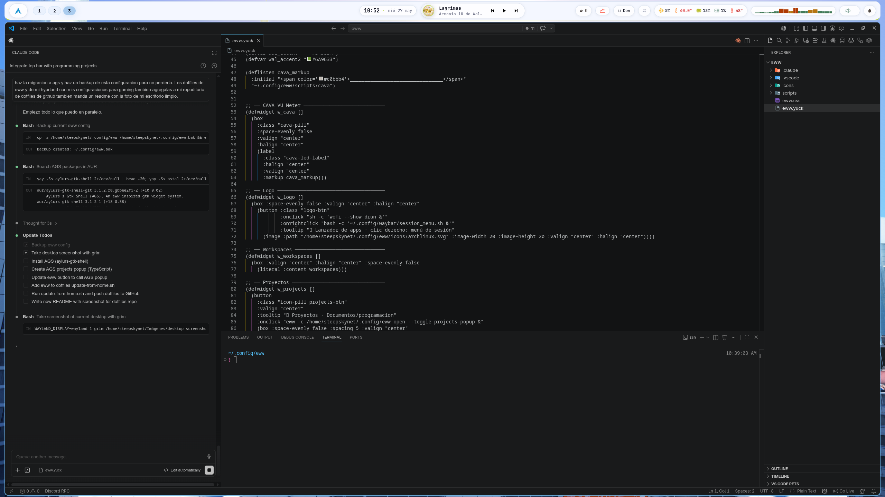

# steepskynet dotfiles

Arch Linux desktop · Hyprland · Mirror's Edge aesthetic



## Stack

| Layer | Tool |
|---|---|
| Compositor | [Hyprland](https://hyprland.org) |
| Bar + notifications + projects popup | [Quickshell](https://quickshell.org) |
| Terminal | [Kitty](https://sw.kovidgoyal.net/kitty/) |
| Launcher | [Wofi](https://hg.sr.ht/~scoopta/wofi) |
| Theming | [pywal](https://github.com/dylanaraps/pywal) |
| Shell | Zsh + Powerlevel10k |
| GPU | NVIDIA (drivers + NVAPI + DXVK) |
| Display | 2560×1440 @ 180 Hz (DP-1) |

## Bar widgets

All in `~/.config/quickshell/steepbar/` (entry point `shell.qml`), launched via
`qs -c steepbar`. Toggle the bar with `$mainMod, B` (`qs -c steepbar ipc call bar toggle`).

- Workspaces (native `Quickshell.Hyprland` — reactive, no polling)
- Clock + date
- Music player (native `Quickshell.Services.Mpris`)
- CPU · CPU temp · RAM · GPU · GPU temp (reused `scripts/sysinfo`)
- Volume slider (native `Quickshell.Services.Pipewire`, hover-reveal)
- Docker status (reused `scripts/docker_status`, opens lazydocker)
- OBS recording badge (reused `scripts/obs_status`)
- Notification bell — opens the native notification history panel
- **Projects popup** — scans `~/Documentos/programacion/` by language, opens in VS Code
  (`scripts/projects` + `modules/projects/ProjectsPopup.qml`)

## Notifications

A native `Quickshell.Services.Notifications.NotificationServer` (see
`modules/notifications/`) replaces SwayNC entirely: toast popups top-right
(`Popups.qml`, auto-dismiss) plus a history panel toggled from the bell
(`NotificationCenter.qml`).

## Color theming

Colors are generated live from the wallpaper via **pywal**.  
Template: `~/.config/wal/templates/eww-colors.css` → `~/.cache/wal/eww-colors.css`

After changing wallpaper run:
```bash
wal -i /path/to/wallpaper
```

## Gaming config (Hyprland)

- `allow_tearing = true` + `vrr = 2` for low-latency gaming
- `immediate` rendering for Steam games (`steam_app_*`)
- Full-screen rules for Diablo IV and Marvel Rivals
- NVIDIA: `NVD_BACKEND=direct`, `PROTON_ENABLE_NVAPI=1`, `DXVK_ASYNC=1`

## What is included

- Shell: `.zshrc` · `.bashrc` · `.bash_profile` · `.p10k.zsh` · `.npmrc`
- Config: Hyprland · Quickshell · Kitty · Wofi · Cava (standalone visualizer) · GTK · Thunar · OpenRGB · fontconfig · pywal templates
- Package lists: `packages/pacman-native.txt` · `packages/aur.txt` · `packages/npm-global.txt`

Browser profiles, caches, shell history, GPG/SSH keys excluded.

## Install on a new machine

```bash
git clone https://github.com/steepsalvadorman/steepsamadotfiles.git ~/dotfiles
cd ~/dotfiles
./install.sh
```

Restore only files:
```bash
./install.sh --files
```

Restore files + packages:
```bash
./install.sh --all
```

Backup of existing files is written to `~/.dotfiles-backup/<timestamp>/` before overwriting.

## Refresh repo from current machine

```bash
cd ~/dotfiles
./scripts/update-from-home.sh
git add .
git commit -m "Update dotfiles"
git push
```
